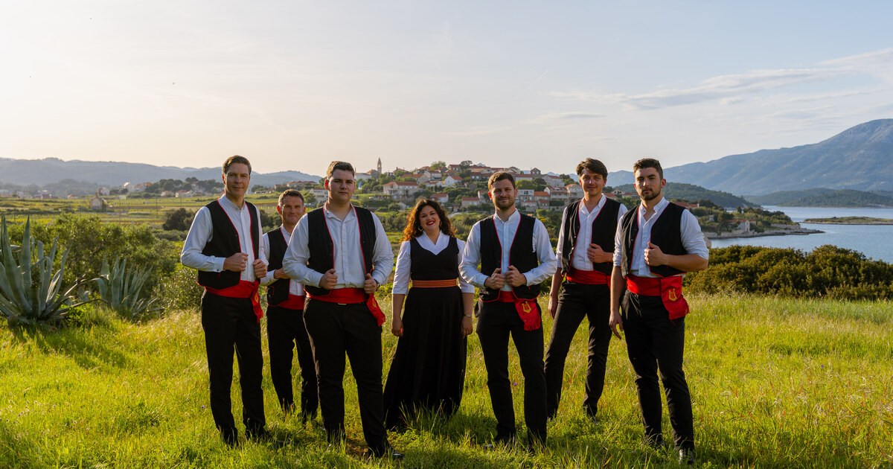

# Klapa Ivo Lozica



A modern, multilingual website for Klapa Ivo Lozica, an award-winning Dalmatian acapella group from Korčula, Croatia. The site showcases the group’s history, guest program, awards, music, references, and contact information.

## Features

- **Multilingual Support:** English and Croatian, with dynamic language switching.
- **Responsive Design:** Optimized for desktop and mobile devices.
- **Animated UI:** Uses AOS (Animate On Scroll) for smooth section transitions.
- **Image Gallery:** Highlights performances and members.
- **Awards Timeline:** Visual timeline of key milestones and festival achievements.
- **Music Player:** Embedded YouTube playlist for listening to performances.
- **References Carousel:** Glider.js-powered carousel with testimonials and press.
- **Contact & Footer:** Easy booking and social media links.

## Project Structure
- `assets/` - images, icons, gallery 
- `css/` - main stylesheet 
- `js/` - scripts for interactivity and translations 
- `index.html` - main HTML file 

## Technologies Used

- **HTML5 & CSS3**
- **JavaScript (ES6)**
- **AOS** for scroll animations
- **Glider.js** for carousel functionality
- **Font Awesome** for icons
- **Google Fonts** for typography

## Getting Started

1. **Clone the repository:**
   ```sh
   git clone https://github.com/jivancevic/klapa-ivo-lozica.git
   cd klapa-ivo-lozica
   ```
2. Open `index.html` in your browser. No build step required - all dependencies are loaded via CDN.

## Customization

- Translations: Edit `js/translations.js` to update or add new languages.
- Images: Replace or add images in the `assets/` folders for gallery, awards, references, and favicon.
- Styles: Modify `css/styles.css` for custom branding or layout changes.
- Scripts: Enhance interactivity in `js/script.js`.

## Deployment

Host the project on any static web server (GitHub Pages, Netlify, Vercel, Cloudflare, etc.). All assets are local except for CDN dependencies.

## Accessibility & SEO
- Uses semantic HTML and ARIA labels for navigation and social links.
- SEO meta tags and Open Graph tags are included and localized.

## License

This project is licensed under the MIT License. See the [LICENSE](LICENSE.md) file for details. For commercial or other use, please contact info@klapaivolozica.com.

_For questions or contributions, please open an issue or contact the group directly._